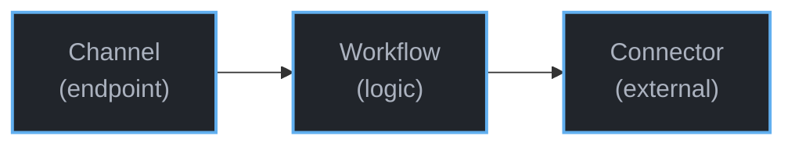
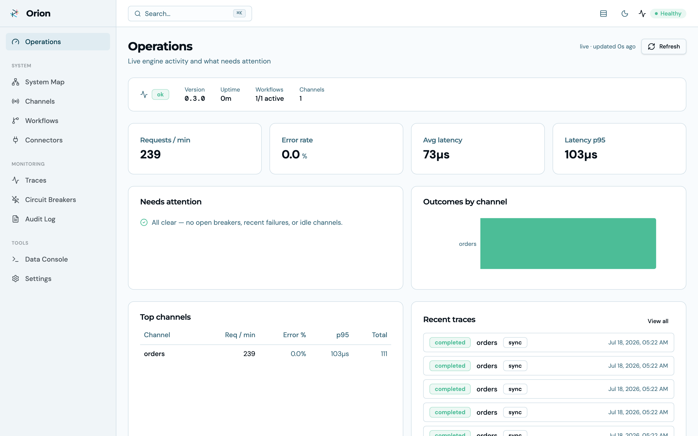
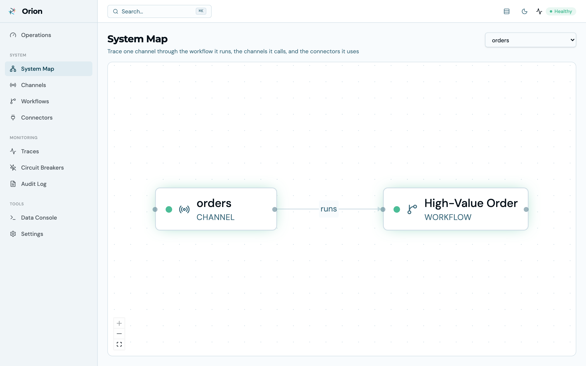
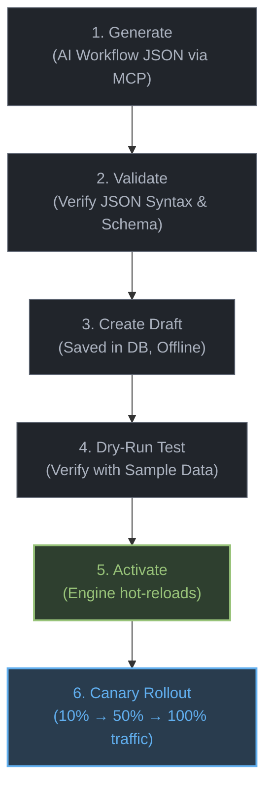
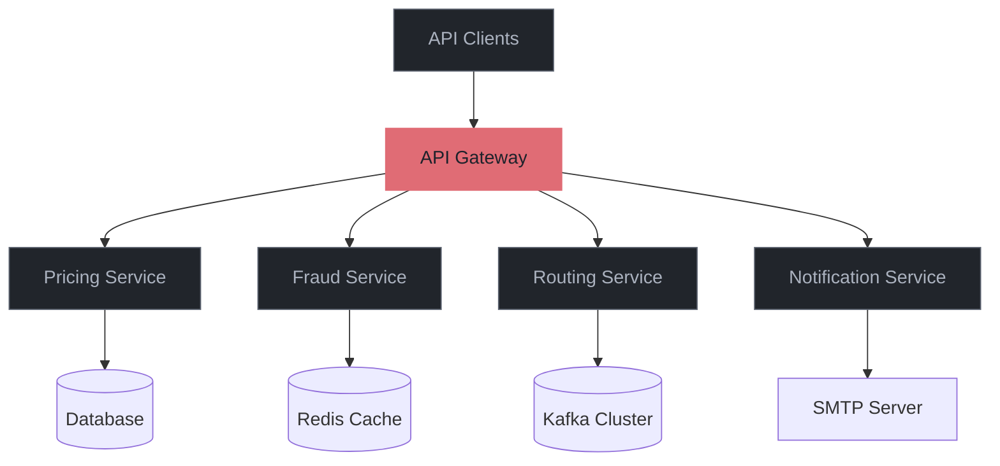
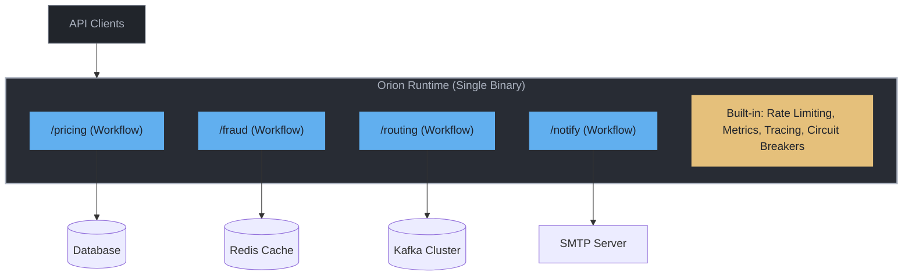
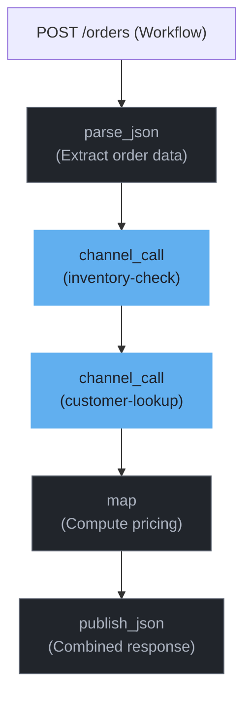
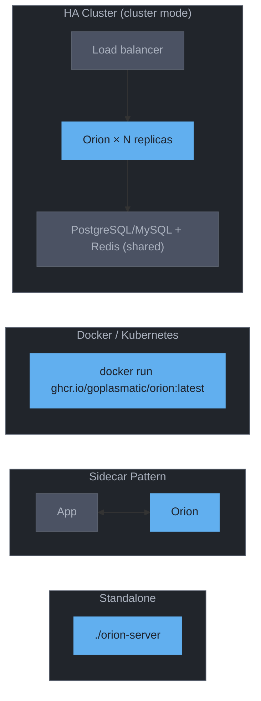

<div align="center">
  

  # Orion

  **Turn business logic into APIs your AI can write and your ops team can trust.**

  *No new service to build. No deploy to wait for.*

  [](https://github.com/GoPlasmatic/Orion/actions/workflows/ci.yml)
  [](https://crates.io/crates/orion-server)
  [](https://opensource.org/licenses/Apache-2.0)
  [](https://www.rust-lang.org)
  [](https://goplasmatic.github.io/Orion/)
  [](https://jsonlogic.com)
  [](https://github.com/GoPlasmatic/Orion/releases)
  [](https://github.com/GoPlasmatic/Orion)
</div>

Every piece of business logic tends to turn into its own microservice. You set up a repo, an HTTP server, a Dockerfile, a CI pipeline, metrics, retries, and a deployment, all before you get to the logic itself.

Orion works the other way around. You write the logic as JSON, either by hand or by asking an AI, and send it to a running Orion server. A second later it's a live API.

Everything you'd normally build around it is already running: rate limits, retries, caching, metrics, tracing, input validation, versioning, and rollback. Change the logic and the endpoint changes with it. No rebuild, no restart, no downtime.

Orion is a single Rust binary. It stores your service definitions in an embedded database and runs them on Tokio and Axum at 6,000+ requests per second. There's nothing to containerize and nothing to provision.

**Jump to:** [Quickstart](#your-first-service-in-2-minutes) · [Why Orion?](#why-orion) · [Is Orion right for you?](#is-orion-right-for-you) · [Three primitives](#three-primitives) · [The console](#the-console) · [What's built in](#whats-built-in) · [Connectors](#connect-to-anything) · [Functions](#built-in-task-functions) · [Performance](#performance) · [Install](#install) · [Docs](#documentation)

---

## Why Orion?

Open a small internal microservice and count the lines. HTTP server setup, connection pools, a Prometheus exporter, OpenTelemetry wiring, retry loops, a circuit breaker, health checks, a Dockerfile, a deploy manifest. Somewhere in the middle sits the logic you actually cared about, and it's maybe fifty lines long. Orion runs that middle part for you and provides everything around it, the same way, for every service.

* **⚡ No service to build:** Idea to live REST or Kafka endpoint in seconds. No Dockerfile, no CI pipeline, no server code.
* **🛡️ Production features included:** Rate limiting, circuit breakers, timeouts, caching, and payload validation on every endpoint. You configure them instead of writing them.
* **🤖 Safe for AI-written logic:** Models generate JSON reliably. Validation, draft-before-activate, dry-run, percentage rollout, and one-call rollback mean AI output can't quietly break production.
* **🦀 Rust speed:** Built on Tokio and Axum. **6,000+ requests/sec** per instance, single-digit millisecond latency, small memory footprint.
* **🧩 Services that call services:** `channel_call` runs another workflow in-process, so there's no network hop and no serialization cost.

---

## Your First Service in 2 Minutes

No code. No Dockerfile. No CI pipeline. Just a running service.

<div align="center">
  <picture>
    <source media="(prefers-color-scheme: dark)" srcset="media/ui-quickstart-dark.gif">
    
  </picture>
  <br>
  <em>Zero to a live service in under a minute: declare the logic, validate and dry-run it, give it an endpoint, then send a request. Tracing and metrics are already on. Prefer a terminal? The same flow is four curl calls, below.</em>
</div>

**1. Start Orion**

```bash
brew install GoPlasmatic/tap/orion-server   # or: curl installer, cargo install (see Install)
orion-server
```

**2. Deploy your first service (one command)**

```bash
curl -fsSL https://raw.githubusercontent.com/GoPlasmatic/Orion/main/examples/quickstart.sh | bash
```

The script talks to the same admin API you'd use in production. It creates a **workflow** (the logic: flag any order over $10,000 for review) and a **channel** (the endpoint: `POST /orders`), activates both, and sends a first test order. Re-running it is safe. Cloned the repo? Run `./examples/quickstart.sh` instead.

<details>
<summary><b>What the script does: the four API calls, spelled out</b></summary>

<div align="center">
  
</div>

Create the workflow, with the business logic as JSON (a parse task, then a conditional flag task):

```bash
curl -s -X POST http://localhost:8080/api/v1/admin/workflows \
  -H "Content-Type: application/json" \
  -d '{
    "workflow_id": "high-value-order",
    "name": "High-Value Order",
    "condition": true,
    "tasks": [
      { "id": "parse", "name": "Parse payload", "function": {
          "name": "parse_json",
          "input": { "source": "payload", "target": "order" }
      }},
      { "id": "flag", "name": "Flag order",
        "condition": { ">": [{ "var": "data.order.total" }, 10000] },
        "function": {
          "name": "map",
          "input": { "mappings": [
            { "path": "data.order.flagged", "logic": true },
            { "path": "data.order.alert", "logic": { "cat": ["High-value order: $", { "var": "data.order.total" }] } }
          ]}
      }}
    ]
  }'

# Activate it (draft → active; the engine hot-reloads)
curl -s -X PATCH http://localhost:8080/api/v1/admin/workflows/high-value-order/status \
  -H "Content-Type: application/json" -d '{"status": "active"}'
```

Create the channel, the endpoint that routes to the workflow, and activate it:

```bash
curl -s -X POST http://localhost:8080/api/v1/admin/channels \
  -H "Content-Type: application/json" \
  -d '{ "channel_id": "orders", "name": "orders", "channel_type": "sync",
        "protocol": "rest", "route_pattern": "/orders",
        "methods": ["POST"], "workflow_id": "high-value-order" }'

curl -s -X PATCH http://localhost:8080/api/v1/admin/channels/orders/status \
  -H "Content-Type: application/json" -d '{"status": "active"}'
```

</details>

**3. Call it. Your service is live**

```bash
curl -s -X POST http://localhost:8080/api/v1/data/orders \
  -H "Content-Type: application/json" \
  -d '{ "data": { "order_id": "ORD-9182", "total": 25000 } }'
```

```json
{
  "status": "ok",
  "data": {
    "order": {
      "order_id": "ORD-9182",
      "total": 25000,
      "flagged": true,
      "alert": "High-value order: $25000"
    }
  }
}
```

That's it. The business logic is a JSON document, deploying it was an API call, and rate limiting, metrics, health checks, and request tracing were already active when it went live. Change the threshold? One API call. No rebuild, no redeploy, no restart.

> **Prefer to describe the service instead of writing it?** Workflow JSON is easy for LLMs to generate. Tell your AI assistant *"flag orders over $10,000 for manual review with an alert message"* and deploy what it returns. [AI Writes Services, Not Code](#ai-writes-services-not-code) shows the safe path from prompt to production.

---

## Is Orion Right for You?

| If you need to... | Orion? | Why |
|---|:-:|---|
| Turn business logic into live REST/Kafka services | **Yes** | Define logic as JSON workflows, deploy with one API call |
| Let AI generate and manage business logic | **Yes** | Built-in validation, dry-run testing, and draft-before-activate safety |
| Replace a handful of single-purpose microservices | **Yes** | One instance handles many channels, governance included |
| Use a rule engine like Drools | **Not quite** | Orion uses [JSONLogic](https://jsonlogic.com) via [datalogic-rs](https://github.com/GoPlasmatic/datalogic-rs) for conditions and transforms. Lightweight and AI-friendly, but not a full RETE-based rule engine with complex fact networks |
| Embed a workflow engine library in your app | **No** | Orion is a standalone runtime, not a library. For an embeddable workflow engine, see [dataflow-rs](https://github.com/GoPlasmatic/dataflow-rs) which Orion is built on |
| Manage services from a browser dashboard | **Yes** | [Orion UI](https://github.com/GoPlasmatic/Orion-ui) manages workflows, channels, and connectors, visualizes pipelines, and monitors health. Orion itself stays API-first |
| Orchestrate long-running jobs (hours/days) | No | Use Temporal or Airflow. Orion is optimized for request-response and event processing |
| Run a full API gateway with plugin ecosystem | No | Use Kong or Envoy. Orion focuses on service logic, not proxy features |
| General-purpose compute (image processing, ML) | No | Orion's task functions operate on JSON data. Use custom services or serverless for arbitrary compute |
| Stateful workflows with human-in-the-loop approvals | No | Use [Temporal](https://temporal.io) or BPMN engines. Orion workflows are stateless request pipelines |

Longer, tool-by-tool discussion (Temporal, Kong, Drools, n8n, dataflow-rs): [Is Orion Right for You?](https://goplasmatic.github.io/Orion/comparison.html)

---

## Three Primitives

You build services in Orion with three things:



| Primitive | What it is | Example |
|-----------|-----------|---------|
| **Channel** | A service endpoint: sync (REST, HTTP) or async (Kafka) | `POST /orders`, `GET /users/{id}`, Kafka topic `order.placed` |
| **Workflow** | A pipeline of tasks that defines what the service does | Parse → validate → enrich → transform → respond |
| **Connector** | A named connection to an external system, with auth and retries | Stripe API, PostgreSQL, Redis, Kafka cluster |

**Design-time:** define channels, build workflows, configure connectors, test with dry-run, manage versions, all through the admin API.

**Runtime:** Orion routes traffic to channels, executes workflows, calls connectors, and handles observability automatically.

---

## The Console

Orion is API-first, and everything it does is also point-and-click. [Orion UI](https://github.com/GoPlasmatic/Orion-ui) is the operations console for a running instance. It gives you live dashboards, a system map of every channel → workflow → connector, workflow logic visualization, trace drill-downs, and a data console for firing test requests. Run `docker compose up` next to the server, or `npm run dev`.

<picture>
  <source media="(prefers-color-scheme: dark)" srcset="media/ui-operations-dark.png">
  
</picture>
<em>Operations: live request rate, error rate, latency, and traces for every channel.</em>

<picture>
  <source media="(prefers-color-scheme: dark)" srcset="media/ui-system-map-dark.png">
  
</picture>
<em>System Map: any channel traced through the workflow it runs and the connectors it touches.</em>

---

## AI Writes Services, Not Code

When AI generates a microservice, you still need to add health checks, metrics, retries, and error handling. When AI generates an Orion workflow, **all of that is already there**. The platform guarantees it.

**Use the [Orion CLI's MCP server](https://github.com/GoPlasmatic/Orion-cli)** to give your AI assistant full Orion context. No manual prompt engineering needed. The MCP server exposes 46 tools covering the full Orion API: workflow syntax, available functions, connector types, and API operations. One config block and you're done (Claude Code `.mcp.json`, Claude Desktop, or any MCP client):

```json
{
  "mcpServers": {
    "orion": {
      "command": "orion-cli",
      "args": ["mcp", "serve"],
      "env": { "ORION_SERVER_URL": "http://localhost:8080" }
    }
  }
}
```

No MCP client? Paste the [**prompt pack**](https://goplasmatic.github.io/Orion/getting-started/prompt-pack.html) into any LLM and it can write and deploy workflows through the plain REST API. It's a self-contained context block with Orion's schemas, conventions, and API calls.

```
You: "Classify orders into VIP (>=500, 15% discount), Premium (100-500, 5%), and Standard tiers"

AI:  → generates valid workflow JSON
     → creates it via the API
     → tests with dry-run
     → activates when you approve
```

**The safe path from AI output to production, every time:**



Every AI-generated workflow gets version history, draft-before-activate, dry-run testing, rollout control, structured `FieldError` validation feedback, and audit trails. It's the same governance hand-written workflows get. Roll back to any previous version instantly.

Need to promote a bundle of workflows, channels, and connectors between environments? `orion-server package` is the promotion story: `export` computes the dependency closure from a source instance into one JSON artifact (git is the registry), `lint` and `plan` check it with zero writes, `apply` stages and activates everything in dependency order with a single engine reload and a version-immutable package receipt, and `diff` reports drift. The bulk import endpoints (`POST /api/v1/admin/{workflows,channels,connectors}/import?dry_run=true`, then drop `dry_run` to commit) remain the low-level primitive when you need to script a single batch. See [Admin API › Export & Promotion](https://goplasmatic.github.io/Orion/api/admin.html#export--promotion).

See [Use Cases & Patterns](https://goplasmatic.github.io/Orion/tutorials/use-cases.html#ai-workflow--cicd) for CI/CD integration and GitHub Actions examples.

---

## Before & After

**Before:** every piece of business logic is its own service to build, deploy, and operate.



**After:** one Orion instance replaces all four. It consolidates the API gateway and the logic engine, routing traffic, running workflows, and handling governance automatically.



**The best of both worlds:** each channel and workflow is independently versioned, testable, and deployable. The modularity of microservices with the operational simplicity of a monolith. Change one workflow without touching the others. Roll back a single channel without redeploying everything.

---

## What's Built In

Every channel gets production-grade features without writing a line of code. Configure per channel or use platform defaults:

| Feature | What it does | Configuration |
|---------|-------------|---------------|
| **Rate limiting** | Throttle requests per client or globally | `requests_per_second`, `burst`, JSONLogic key computation |
| **Timeouts** | Cancel slow workflows, return 504 | `timeout_ms` per channel |
| **Input validation** | Reject bad requests at the boundary | JSONLogic with access to headers, query params, path params |
| **Backpressure** | Shed load when overwhelmed, return 503 | `max_concurrent_per_node` (semaphore-based) |
| **CORS** | Control browser cross-origin access | `origin_allow_list` per channel |
| **Circuit breakers** | Stop cascading failures to external services | Automatic per connector, admin API to inspect/reset |
| **Versioning** | Draft → active → archived lifecycle | Automatic version history, rollout percentages, instant rollback |
| **Observability** | Prometheus metrics, structured logs, distributed tracing | Always on, zero configuration |
| **Health checks** | Component-level status with degradation detection | `GET /health`, automatic |
| **Request IDs** | UUID propagated through the entire pipeline | `x-request-id` header, automatic |
| **Deduplication** | Prevent duplicate processing via idempotency keys | `Idempotency-Key` header, configurable retention window |
| **Response caching** | Cache responses for identical requests | TTL-based, configurable cache key fields |
| **Per-request profiling** | Break a single request down by phase (engine lock, workflow run, tasks) | Opt in with `X-Orion-Profile: 1` or `?profile=1`; surfaces under `_orion.profile` |
| **Per-task tracing** | Capture each task's input/output for replay and debugging | Channel-level `config.tracing.per_task = true`; stored on the trace row |

A minimal channel needs only a name and a workflow. Everything else has sensible defaults.

> **Observability deep dive:** health endpoints, full Prometheus metrics list, Kubernetes probes, and OpenTelemetry tracing config. See [Observability Guide](https://goplasmatic.github.io/Orion/features/observability.html).

---

## Sync and Async

```
Sync     POST /api/v1/data/{channel}         → immediate response
Async    POST /api/v1/data/{channel}/async   → returns trace_id, poll later

REST     GET /api/v1/data/orders/{id}        → matched by route pattern
Kafka    topic: order.placed                 → consumed automatically
```

Sync channels respond immediately. Async channels return a trace ID; poll `GET /api/v1/admin/traces/{id}` for results. Kafka channels consume from topics configured in the DB or config file, no restart needed when you add new ones.

**Bridging is a pattern, not a feature.** A sync workflow can `publish_kafka` and return 202. An async channel picks it up from there.

REST channels support parameterized route patterns (`/orders/{order_id}`) with path, query, and header injection into the workflow context. See [Data API](https://goplasmatic.github.io/Orion/api/data.html#route-resolution).

## Service Composition

Most platforms require HTTP calls between services, adding latency, failure modes, and serialization overhead. Orion's `channel_call` invokes another channel's workflow **in-process** with zero network round-trip:



Each composed channel has its own workflow, versioning, and governance, but calls between them are function calls, not network hops. Cycle detection prevents infinite recursion.

---

## Connect to Anything

Connectors are named, reusable connections to external systems. Configure once, reference by name in any workflow. Credentials stay out of your logic:

| Connector type | Systems | Features |
|---------------|---------|----------|
| **HTTP** | Any REST API, webhook, or service | Bearer / Basic / API key auth, retry with backoff, SSRF protection |
| **Database** | PostgreSQL, MySQL, SQLite | Parameterized queries, connection pooling, read + write operations |
| **Cache** | In-memory (built-in) or Redis | TTL-based expiry, also powers deduplication and response caching |
| **MongoDB** | Any MongoDB instance | Document queries, BSON-to-JSON conversion, connection pooling |
| **Elasticsearch** | Any Elasticsearch cluster | Portable `data_query`/`data_write` rendered to Query DSL and `_bulk`, via the shared HTTP client |
| **Kafka** | Any Kafka cluster | Publish with key/value logic, consume with DLQ routing |

Every connector gets **circuit breaker protection** automatically: failures trip the breaker, subsequent calls fast-fail, and the breaker auto-recovers. Database and Elasticsearch connectors also carry **per-operation gates** (`operations: { read, insert, update, delete, upsert, raw_write }`). Set `"delete": false` and no workflow can delete through that connector, no matter what its tasks say. Secrets are stored in the database and masked in API responses, and any string field can use an `env://VAR_NAME` reference to pull the value from the process environment at startup so production credentials never sit in the saved config. See [Connectors Guide](https://goplasmatic.github.io/Orion/features/extensibility.html#connectors) for configuration examples and auth options.

---

## Built-in Task Functions

| Function | Description |
|----------|-------------|
| `parse_json` | Parse payload into the data context for downstream tasks |
| `parse_xml` | Parse XML payloads into structured JSON |
| `filter` | Allow or halt processing based on JSONLogic conditions |
| `map` | Transform and reshape JSON using JSONLogic expressions |
| `validation` | Enforce required fields, constraints, and schema-like checks |
| `http_call` | Invoke downstream APIs, webhooks, or services via [connectors](https://goplasmatic.github.io/Orion/features/extensibility.html#connectors) |
| `channel_call` | Invoke another channel's workflow in-process |
| `data_query` | Portable, backend-neutral read (filter, project, sort, paginate, include related records) that runs unchanged on SQL, MongoDB, or Elasticsearch |
| `data_write` | Portable insert/update/delete/upsert using the same envelope across SQL, MongoDB, and Elasticsearch |
| `db_read` | Execute raw SQL SELECT queries, return rows as JSON (escape hatch for CTEs, aggregations, hand-tuned SQL) |
| `db_write` | Execute raw SQL INSERT/UPDATE/DELETE, return affected count |
| `cache_read` | Read from in-memory or Redis cache |
| `cache_write` | Write to cache with optional TTL |
| `mongo_read` | Query MongoDB collections, BSON-to-JSON conversion |
| `publish_json` | Serialize data to JSON output format |
| `publish_xml` | Serialize data to XML output format |
| `publish_kafka` | Publish messages to [Kafka topics](https://goplasmatic.github.io/Orion/features/extensibility.html#kafka-connector) |
| `log` | Emit structured log entries for auditing and debugging |

All functions are built into every binary. The dataflow-rs runtime contributes `parse_json`/`parse_xml`/`filter`/`map`/`validation`/`publish_json`/`publish_xml`/`log`; Orion adds the connector-backed handlers (`http_call`, `data_query`, `data_write`, `db_read`, `db_write`, `cache_read`, `cache_write`, `mongo_read`, `publish_kafka`) and the in-process `channel_call`. `data_query`/`data_write` speak the [portable data dialect](https://goplasmatic.github.io/Orion/reference/data-dialect.html). Write the query once and switch backends by switching connectors. `cache_read`/`cache_write` use the in-memory backend by default; reference a Redis connector for distributed caching. See the [Function Reference](https://goplasmatic.github.io/Orion/reference/functions.html) for every function's exact `input` schema, or browse them at runtime via `GET /api/v1/admin/functions`.

---

## When Things Go Wrong

Production services fail. Orion handles it so you don't write retry loops and fallback logic:

| Failure | What Orion does | You configure |
|---------|----------------|---------------|
| **External API down** | Circuit breaker trips, fast-fails subsequent calls, auto-recovers | `failure_threshold`, `recovery_timeout_secs` per connector |
| **Slow workflow** | Timeout fires, returns 504 to caller | `timeout_ms` per channel |
| **Traffic spike** | Rate limiter rejects excess requests (429), backpressure sheds load (503) | `requests_per_second`, `max_concurrent_per_node` per channel |
| **Async task fails** | Moved to Dead Letter Queue, retried automatically with backoff | `dlq_max_retries`, `dlq_poll_interval_secs` |
| **Task in pipeline fails** | Pipeline halts with error, or continues collecting errors if `continue_on_error: true` | Per-workflow setting |
| **Duplicate request** | Detected via idempotency key, returns 409 | `Idempotency-Key` header + retention window |

**Debugging is built in.** Every request gets a `x-request-id` propagated through the entire pipeline. Structured JSON logs show what data each task received and produced. Enable OpenTelemetry for distributed tracing across `http_call` and `channel_call` chains. Inspect circuit breakers, DLQ traces, and debug endpoints via the [API Reference](https://goplasmatic.github.io/Orion/api/admin.html).

---

## Deploy Anywhere



Single binary. SQLite by default, no database to provision, no runtime dependencies. Need more scale? Swap to **PostgreSQL** or **MySQL** by changing the `storage.url`. No rebuild needed.

**Need more than one node? Turn on cluster mode.** N identical replicas behind a load balancer share one PostgreSQL/MySQL and one Redis and behave as a single logical system: a config change made through any node reaches every node in about two seconds, idempotency keys and rate limits hold across the whole fleet (one execution per key, limits counted fleet-wide, cache hits shared), and rolling deploys are zero-downtime — replicas drain gracefully while the rest keep serving. It ships two packaged ways:

```bash
# Kubernetes — published to GHCR on every release
helm install orion oci://ghcr.io/goplasmatic/charts/orion

# Anywhere else — nginx + 2 replicas + Postgres + Redis, migrations included
docker compose -f docker-compose.ha.yml up
```

**Same channel definitions work in any topology:** one instance, an HA cluster, sidecars — or dedicated capacity by splitting channels across instance pools with include/exclude filters. The definition doesn't change; only the deployment config does.

## Performance

**6K–7K workflow requests/sec** on a single instance, as measured on **v0.2.0** (Apple M-series, release build, 50 concurrent connections). These are the v0.2.0 record, not a 1.0.0 claim — the 1.0.0 numbers, including a cluster scenario, will be re-measured on dedicated hardware for the release:

<picture>
  <source media="(prefers-color-scheme: dark)" srcset="media/benchmark-dark.svg">
  
</picture>

| Scenario (v0.2.0) | Req/sec | Avg Latency | P99 Latency |
|----------|--------:|------------:|------------:|
| Simple workflow (1 task) | 7,446 | 6.7 ms | 16.7 ms |
| Complex workflow (4 tasks) | 6,053 | 8.2 ms | 25.5 ms |

An earlier third row, *"12 workflows on one channel"* (6,912 req/s), is retired: the 1.0 benchmark audit found it exercised the same code path as the simple workflow, and its 1.0 replacement — a 12-channel estate — measures something the old number is not comparable to. Run `./tests/benchmark/bench.sh` to reproduce the single-instance scenarios, and `./tests/benchmark/bench.sh cluster` to drive the HA compose stack through its load balancer.

Pre-compiled JSONLogic, zero-downtime hot-reload, lock-free reads, SQLite WAL mode, async-first on Tokio.

---

## Use Cases

- **Replace microservices:** define REST endpoints as channels, logic as workflows, external calls as connectors
- **Webhook gateway:** normalize Stripe, GitHub, Shopify payloads into a consistent internal schema
- **Event processing:** Kafka-to-workflow pipelines with transforms, enrichment, and routing
- **API composition:** use `channel_call` to compose services from other services
- **AI-managed business logic:** LLMs create and update workflows via the REST API
- **Multi-agent orchestration:** route agent outputs to channels with coordinating workflows
- **Protocol bridging:** REST-to-Kafka, Kafka-to-HTTP with transformation

See [Use Cases & Patterns](https://goplasmatic.github.io/Orion/tutorials/use-cases.html) for complete, tested examples, or grab ready-to-deploy JSON from [`examples/`](examples/) and run `./deploy.sh <example>` against a local instance.

## Install

```bash
# Docker (quickest way to try)
docker run -p 8080:8080 ghcr.io/goplasmatic/orion:latest

# Docker Compose (with persistent storage)
docker compose up  # uses docker-compose.yml from this repo

# macOS (Homebrew — Apple silicon; Intel Macs use the shell installer below)
brew install GoPlasmatic/tap/orion-server

# macOS / Linux (shell installer)
curl --proto '=https' --tlsv1.2 -LsSf https://github.com/GoPlasmatic/Orion/releases/latest/download/orion-server-installer.sh | sh

# Windows (PowerShell)
powershell -ExecutionPolicy ByPass -c "irm https://github.com/GoPlasmatic/Orion/releases/latest/download/orion-server-installer.ps1 | iex"

# From crates.io
cargo install orion-server

# From source
cargo install --git https://github.com/GoPlasmatic/Orion.git
```

Verify with `orion-server --version`. Swagger UI available at `http://localhost:8080/docs`. See [Configuration](https://goplasmatic.github.io/Orion/configuration/reference.html) for deployment options.

The server binary also ships diagnostic and promotion subcommands you can run without booting the HTTP listener:

```bash
orion-server validate-config -c config.toml         # Parse + validate the config file
orion-server validate-config --format summary       # One-screen view of the headline settings, secrets redacted
orion-server migrate                                # Run pending DB migrations
orion-server migrate --dry-run                      # Preview pending migrations
orion-server lint path/to/workflow.json             # Strict-validate a workflow JSON file
orion-server dry-run -w workflow.json -i input.json # Execute a workflow against a sample payload
orion-server dry-run -w workflow.json -i input.json --stubs stubs.json  # ...with connector calls answered from canned responses
orion-server test examples/workflow-tests           # Run offline *.case.json workflow regression tests
orion-server test-connectivity                      # Probe DB (and Kafka if enabled)
orion-server preflight                              # Scan stored channels/workflows before upgrading
orion-server dump-openapi > docs/openapi.json       # Write the OpenAPI 3.1 spec (checked in for offline use / client gen)
orion-server package export -s https://dev.example.com --tag payments --name payments --version 1.4.0 -o payments.json  # Export a package: selected channels + their workflows + referenced connectors
orion-server package lint -f payments.json          # Validate the artifact offline — no server, no secrets
orion-server package plan -s https://prod.example.com -f payments.json   # Pre-flight against a target instance, zero writes
orion-server package apply -s https://prod.example.com -f payments.json  # Stage, activate in dependency order, one reload — idempotent, receipt-tracked
orion-server package diff -s https://prod.example.com -f payments.json   # Drift report; non-zero exit on any difference
```

`${VAR}` / `${VAR:-default}` placeholders inside `config.toml` are substituted from the environment when any of these subcommands load the config, so the same file works across dev, staging, and prod without templating.

### CLI Tool

Manage workflows, channels, and connectors without writing curl commands:

```bash
# Install
brew install GoPlasmatic/tap/orion-cli                # Homebrew
curl --proto '=https' --tlsv1.2 -LsSf https://github.com/GoPlasmatic/Orion-cli/releases/latest/download/orion-cli-installer.sh | sh  # Shell installer
cargo install --git https://github.com/GoPlasmatic/Orion-cli.git  # From source

# Deploy a workflow from a JSON file
orion-cli workflows create -f order-processing.json
orion-cli --yes workflows activate high-value-order
orion-cli channels create -f orders-channel.json
orion-cli --yes channels activate orders
```

See [CLI Reference](https://github.com/GoPlasmatic/Orion-cli) for the full command list.

## Documentation

| Guide | Description |
|-------|-------------|
| [Workflow Reference](https://goplasmatic.github.io/Orion/reference/workflows.html) | Workflow & task JSON schema, conditions, error handling, lifecycle, and rollout |
| [Function Reference](https://goplasmatic.github.io/Orion/reference/functions.html) | Every built-in task function and its exact `input` schema |
| [Portable Data Dialect](https://goplasmatic.github.io/Orion/reference/data-dialect.html) | Backend-neutral query/write envelope for `data_query`/`data_write`, with one filter dialect across SQL, MongoDB, and Elasticsearch |
| [Admin API](https://goplasmatic.github.io/Orion/api/admin.html) | Workflows, channels, connectors, packages, engine, audit, and backup endpoints |
| [Data API](https://goplasmatic.github.io/Orion/api/data.html) | Data routing, sync/async processing, traces, and operational endpoints |
| [Configuration](https://goplasmatic.github.io/Orion/configuration/reference.html) | Config file, env vars, database backends, deployment |
| [Connectors & Extensibility](https://goplasmatic.github.io/Orion/features/extensibility.html) | HTTP, DB, Cache, Storage, MongoDB, Elasticsearch, Kafka: auth, retry, circuit breakers |
| [Observability](https://goplasmatic.github.io/Orion/features/observability.html) | Prometheus metrics, health checks, Kubernetes probes, tracing, logging |
| [Resilience](https://goplasmatic.github.io/Orion/features/resilience.html) | Circuit breakers, timeouts, dead letter queues |
| [Scalability](https://goplasmatic.github.io/Orion/features/scalability.html) | Rate limiting, backpressure, horizontal scaling |
| [Security](https://goplasmatic.github.io/Orion/features/security.html) | Input validation, SSRF protection, CORS, auth |
| [Deployability](https://goplasmatic.github.io/Orion/features/deployability.html) | Packaging, Docker, installers, distribution |
| [Availability](https://goplasmatic.github.io/Orion/features/availability.html) | HA topology, failure modes, recovery drills |
| [Maintainability](https://goplasmatic.github.io/Orion/features/maintainability.html) | Backups, migrations, audit logs, upgrade procedure |
| [Use Cases & Patterns](https://goplasmatic.github.io/Orion/tutorials/use-cases.html) | AI prompt templates, tested examples, validation workflows, CI/CD |
| [CLI Tool](https://github.com/GoPlasmatic/Orion-cli) | Command-line tool for managing channels, workflows, and connectors |

## Built With

[Axum](https://github.com/tokio-rs/axum) (HTTP), [Tokio](https://tokio.rs) (async runtime), [SQLx](https://github.com/launchbadge/sqlx) (database), [sea-query](https://github.com/SeaQL/sea-query) (portable SQL builder), SQLite/PostgreSQL/MySQL (storage), [datalogic-rs](https://github.com/GoPlasmatic/datalogic-rs) (JSONLogic), [dataflow-rs](https://github.com/GoPlasmatic/dataflow-rs) (workflow orchestration).

## Ecosystem & Roadmap

Orion ships with two companion projects:

- **[Orion UI](https://github.com/GoPlasmatic/Orion-ui):** the admin dashboard. Manage workflows, channels, and connectors, visualize workflow pipelines, inspect audit trails, and monitor engine health from the browser.
- **[Orion CLI](https://github.com/GoPlasmatic/Orion-cli):** the command-line interface and MCP server. Manage everything from your terminal or AI assistant.

Under consideration: workflow marketplace (community templates), cron-based scheduling, WASM task functions, and language SDKs. Have an idea or want to push one of these forward? [Open an issue](https://github.com/GoPlasmatic/Orion/issues) or start a [discussion](https://github.com/GoPlasmatic/Orion/discussions).

## Who's Using Orion?

Using Orion in a project, a company, or a side quest? Add yourself to [ADOPTERS.md](ADOPTERS.md) with a one-line PR, or share what you built in [Discussions](https://github.com/GoPlasmatic/Orion/discussions). Real-world usage reports directly shape the roadmap.

## Contributing

Contributions welcome! Whether it's a bug fix, new connector, documentation improvement, or feature request, we'd love to hear from you.

```bash
cargo build                              # Build (all features included)
cargo build --release                    # Release build
cargo test                               # Run tests
cargo clippy                             # Lint
cargo fmt                                # Format
```

- **Report bugs:** [Open an issue](https://github.com/GoPlasmatic/Orion/issues)
- **Ask questions:** [GitHub Discussions](https://github.com/GoPlasmatic/Orion/discussions)
- **Report security issues privately:** see [SECURITY.md](SECURITY.md)
- **Submit code:** Fork, branch, PR. All tests must pass (`cargo test && cargo clippy`)
- **Docs recordings:** the README GIFs and mdBook asciinema casts are generated from real sessions. See [`docs/recordings/`](docs/recordings/) to regenerate them.

## Support the Project

If Orion looks useful, a ⭐ on this repo is the easiest way to help other developers find it. Beyond that: share what you build in [Discussions](https://github.com/GoPlasmatic/Orion/discussions), add yourself to [ADOPTERS.md](ADOPTERS.md), or send this to a colleague who's tired of building a new service for every bit of business logic.

## License

Apache-2.0. See [LICENSE](LICENSE) for details.
