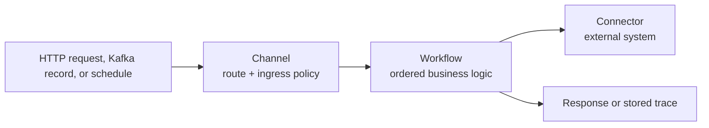
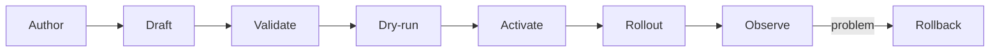

<div align="center">
  

  # Orion

  **Build services at AI speed on a consistent, governed foundation.**

  Define the business logic in JSON. Orion supplies the runtime around it.

  [](https://github.com/GoPlasmatic/Orion/actions/workflows/ci.yml)
  [](https://crates.io/crates/orion-server)
  [](LICENSE)
  [](https://www.rust-lang.org)
  [](https://docs.goplasmatic.io/)
  [](https://github.com/GoPlasmatic/Orion/releases)
</div>

Orion is a declarative services runtime. An Orion service consists of a
**workflow** and a **channel**, with optional **connectors** to external systems.
Post those definitions, activate them, and the service is live—without writing
an application server, building a container for each service, or restarting the
runtime.

Orion consistently handles the surrounding infrastructure: routing, ingress
guards, rate limits, timeouts, retries, circuit breakers, connection pooling,
version rollout, rollback, metrics, and tracing. Definitions can be written by
a developer or proposed by an AI assistant; they follow the same draft, test,
activation, and audit path.

> [!NOTE]
> Orion is designed for request- and event-shaped work expressible as ordered
> task functions and JSONLogic. It is not a general-purpose application runtime
> or a durable workflow engine. See [When Orion fits](#when-orion-fits) before
> choosing it for a project.

## Quickstart

This tested path uses Docker, `curl`, and a POSIX-compatible shell. It starts a
local Orion instance, deploys an order-processing workflow and channel, and
calls the resulting API.

### 1. Start Orion

```bash
docker run --name orion-quickstart -d -p 8080:8080 \
  ghcr.io/goplasmatic/orion:latest

curl --retry 10 --retry-delay 1 --retry-connrefused \
  http://localhost:8080/healthz
```

### 2. Inspect and deploy the example

```bash
curl -fsSLo /tmp/orion-quickstart.sh \
  https://raw.githubusercontent.com/GoPlasmatic/Orion/main/examples/quickstart.sh
less /tmp/orion-quickstart.sh
bash /tmp/orion-quickstart.sh
```

The script makes four administration calls: it creates and activates a
workflow, then creates and activates its channel. It finishes with a test
request and is safe to run again. From a cloned repository, run
`./examples/quickstart.sh` instead.

### 3. Call your service

```bash
curl -fsS -X POST http://localhost:8080/api/v1/data/orders \
  -H 'Content-Type: application/json' \
  -d '{ "data": { "order_id": "ORD-0001", "total": 12500 } }'
```

The response contains the parsed order with `"flagged": true`. The workflow
holds the business logic; the channel exposes it at `POST /orders`. Routing,
validation, tracing, and lifecycle management are supplied by Orion.

For expected output, troubleshooting, Windows-friendly installation paths, and
cleanup instructions, follow the
[complete quickstart](https://docs.goplasmatic.io/getting-started/quickstart.html).

## The core model



| Primitive | Purpose | Example |
|---|---|---|
| **Channel** | Receives traffic and applies ingress policy | `POST /orders`, Kafka topic, `0 15 2 * * *` `order.placed` |
| **Workflow** | Runs the business logic as an ordered task pipeline | Parse → validate → enrich → respond |
| **Connector** | Provides a reusable connection to an external system | PostgreSQL, Redis, Kafka, REST API |

The definitions belonging to one service can be shipped together as a
**package**. One Orion instance can run many packages side by side, each with
its own lifecycle and rollout.

[How Orion works](https://docs.goplasmatic.io/concepts/how-orion-works.html)
explains request execution, composition, deployment topology, and extension
boundaries in one page.

## What you can build

- **Microservice and decision APIs:** expose transformations, validation,
  pricing, eligibility, and routing decisions over HTTP.
- **Webhook and data-ingestion services:** normalize incoming payloads and
  read or write external systems through governed connectors.
- **Kafka consumers:** process records, publish results, and route failed
  messages to a dead-letter topic.
- **AI-agent tools:** expose governed HTTP operations that an assistant can
  draft, dry-run, activate, and roll back using the Orion CLI and agent skill.
- **Composable services:** call another channel in-process with `channel_call`,
  while preserving the callee's guards and preventing cycles.

Choose a focused path in
[What are you building?](https://docs.goplasmatic.io/getting-started/use-cases.html),
or deploy a tested package from [`examples/packages/`](examples/packages/).

## Runtime capabilities

| Area | Included capability |
|---|---|
| **Traffic** | REST, plain HTTP, synchronous and asynchronous channels, Kafka ingress |
| **Safety** | Payload validation, API-key/HMAC/JWT channel auth, rate limiting, backpressure, CORS controls |
| **Resilience** | Timeouts, retries, circuit breakers, idempotency, response caching, dead-letter handling |
| **Delivery** | Drafts, immutable versions, dry-runs, percentage rollout, rollback, packages |
| **Observability** | Health and readiness endpoints, Prometheus metrics, structured logs, OpenTelemetry traces |
| **Data** | PostgreSQL, MySQL, SQLite, MongoDB, Elasticsearch, Redis, Kafka, HTTP, SMTP, S3-compatible storage |
| **Operations** | Embedded SQLite for one node; PostgreSQL/MySQL and Redis for clustered replicas |

Configuration is explicit, and several production controls are permissive or
disabled for local development. In particular, data channels are open unless
they declare authentication or sit behind an authenticating proxy. Before
exposing an instance, work through the
[production checklist](https://docs.goplasmatic.io/operate/production-checklist.html).

## Safe changes, including AI-generated ones



Workflow, channel, and connector definitions use the same governed lifecycle
regardless of who authored them. A draft serves no traffic. You can validate
and dry-run it, approve the exact version, activate it without restarting the
server, roll traffic out by percentage, and return to a previous immutable
version. Administrative changes are recorded in the audit log.

For AI-assisted authoring, install the [Orion agent
skill](https://docs.goplasmatic.io/ai/skills.html) or use the self-contained
[prompt pack](https://docs.goplasmatic.io/ai/prompt-pack.html). The
[Claude Code tutorial](https://docs.goplasmatic.io/ai/claude-code.html) walks
through a complete assisted workflow.

## When Orion fits

Orion fits services whose work starts with an HTTP request or Kafka record,
completes as a bounded pipeline, and can be expressed with Orion's task
functions and JSONLogic. It is especially useful when many small services need
the same operational and governance foundation.

Choose another runtime, or pair one with Orion, when:

- work must survive restarts at an intermediate step or wait hours or days;
- ingress requires gRPC, WebSockets, or streaming responses;
- business logic requires arbitrary code with I/O, or a scripting runtime — a
  pure transformation ships as a sandboxed WebAssembly plugin, anything that
  has to reach another system does not;
- image processing, model inference, or large in-memory joins sit on the hot
  path; or
- full OIDC flows or mutual TLS must terminate inside the data plane. JWT
  verification is built in; those flows require a gateway or service mesh.

Read [Is Orion right for
you?](https://docs.goplasmatic.io/comparison.html) for detailed comparisons
with durable execution engines, API gateways, automation platforms, rule
engines, and embedded `dataflow-rs`.

## Install

The current workspace release is **1.5.1** and requires Rust **1.98** when built
from source. The server and CLI are released in lockstep; use matching versions.

```bash
# Homebrew: macOS Apple Silicon and Linux
brew install GoPlasmatic/tap/orion-server
brew install GoPlasmatic/tap/orion-cli

# Server from source
cargo install --git https://github.com/GoPlasmatic/Orion --locked orion-server

# Server and CLI from source
cargo install --git https://github.com/GoPlasmatic/Orion --locked \
  orion-server orion-cli
```

Release installers are also available for Linux, macOS Apple Silicon, and
Windows. See [Install &
Run](https://docs.goplasmatic.io/getting-started/install.html) for every method,
platform support, startup, and verification.

Useful local commands:

```bash
orion-server validate-config -c config.toml
orion-server fmt ./definitions
orion-server lint workflow.json
orion-server clippy ./definitions
orion-server dry-run -w workflow.json -i input.json
orion-server test examples/workflow-tests
orion-server compile ./definitions -o package.json
orion-server package apply -s http://localhost:8080 -f package.json
```

The [server command
reference](https://docs.goplasmatic.io/reference/configuration.html#cli-commands)
and [Orion CLI reference](https://docs.goplasmatic.io/reference/cli.html) list
all commands and flags.

## Performance

The published Orion 1.0.0 benchmark measured **5.1K–5.7K workflow requests per
second** on one Apple M2 Pro instance, with single-digit-millisecond average
latency across the recorded workflow scenarios. These are release- and
workload-specific results, not capacity guarantees. Review the
[benchmark record](crates/orion-server/tests/benchmark/results/v1.0.0/SUMMARY.md)
for hardware, scenarios, tail latency, cluster results, and reproduction steps.

## Documentation

The full manual is at **[docs.goplasmatic.io](https://docs.goplasmatic.io/)**.

| Goal | Start here |
|---|---|
| Try Orion | [Quickstart](https://docs.goplasmatic.io/getting-started/quickstart.html) |
| Understand the model | [How Orion works](https://docs.goplasmatic.io/concepts/how-orion-works.html) |
| Build a complete service | [Orders API golden path](https://docs.goplasmatic.io/guides/orders-golden-path.html) |
| Find an exact schema | [Reference index](https://docs.goplasmatic.io/reference/) |
| Deploy and operate | [Operate Orion](https://docs.goplasmatic.io/operate/) |
| Secure production | [Production checklist](https://docs.goplasmatic.io/operate/production-checklist.html) |
| Upgrade safely | [Upgrades](https://docs.goplasmatic.io/operate/upgrades.html) |
| Check compatibility | [Support & compatibility](https://docs.goplasmatic.io/reference/support.html) |

The documentation source lives in [`docs/src/`](docs/src/). Edit that directory,
not the generated `docs/book/` output. See [`docs/STYLE_GUIDE.md`](docs/STYLE_GUIDE.md)
for its structure and editorial conventions.

## Project and community

- [Orion UI](https://github.com/GoPlasmatic/Orion-ui) provides the browser-based
  operations console.
- [`orion-cli`](crates/orion-cli/) manages workflows, channels, and connectors
  from a terminal.
- [`CONTRIBUTING.md`](CONTRIBUTING.md) covers development setup, tests, and pull
  requests.
- Use [GitHub Discussions](https://github.com/GoPlasmatic/Orion/discussions) for
  questions and [GitHub Issues](https://github.com/GoPlasmatic/Orion/issues) for
  bugs.
- Report vulnerabilities privately according to [`SECURITY.md`](SECURITY.md).
- If you use Orion, add your project to [`ADOPTERS.md`](ADOPTERS.md).

Orion is built by [Plasmatic](https://goplasmatic.io) and released under the
[Apache License 2.0](LICENSE).
