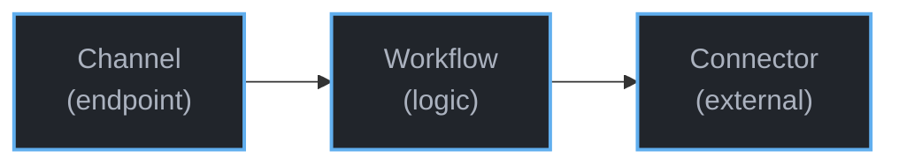
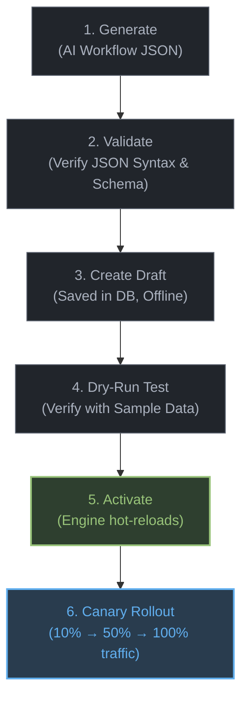
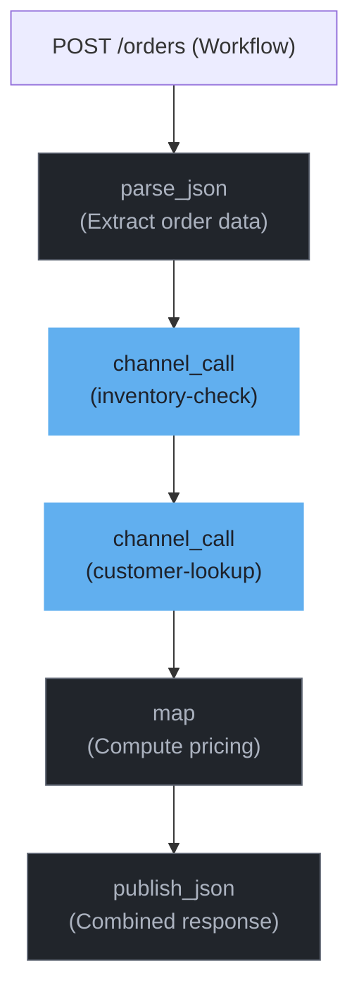
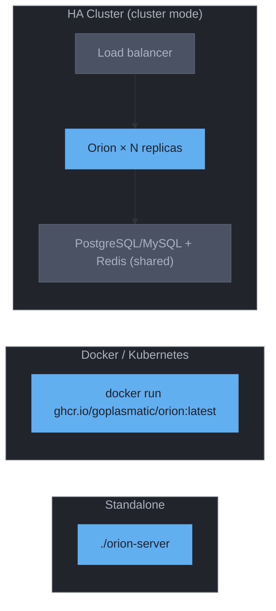
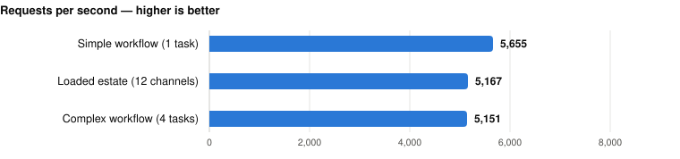

<div align="center">
  

  # Orion

  **The declarative runtime for AI agents, workflows, microservices, and event processing.**

  *Safe enough to let an AI write your services. Fast enough to run them in production.*

  [](https://github.com/GoPlasmatic/Orion/actions/workflows/ci.yml)
  [](https://crates.io/crates/orion-server)
  [](https://opensource.org/licenses/Apache-2.0)
  [](https://www.rust-lang.org)
  [](https://docs.goplasmatic.io/)
  [](https://jsonlogic.com)
  [](https://github.com/GoPlasmatic/Orion/releases)
  [](https://github.com/GoPlasmatic/Orion)
</div>

Orion is a declarative services runtime. A service is one JSON document holding the logic, the connectors it reaches, and the endpoint it answers on. Post it to a running server and it is live a second later. No rebuild, no restart, no downtime.

Everything around that logic is the runtime's job, and it works the same way for every service you put on it: route and protocol matching, ingress guards, rate limiting, circuit breaking, fault tolerance, connection pooling, zero-downtime hot reload, and end-to-end observability. That is the glue you would otherwise write again for every microservice, agent backend, stream processor, and data pipeline.

It ships as a single Rust binary on Tokio and Axum, storing your service definitions in an embedded database. There is nothing to containerize and nothing to provision.

**Jump to:** [Quickstart](#your-first-service-in-2-minutes) · [What you get](#what-you-get) · [What you can build](#what-you-can-build) · [Is Orion right for you?](#is-orion-right-for-you) · [Three primitives](#three-primitives) · [The console](#the-console) · [What's built in](#whats-built-in) · [Connectors](#connect-to-anything) · [Functions](#built-in-task-functions) · [Performance](#performance) · [Install](#install) · [Docs](#documentation)

---

## What You Get

Open a small internal microservice and count the lines. HTTP server setup, connection pools, a Prometheus exporter, OpenTelemetry wiring, retry loops, a circuit breaker, health checks, a Dockerfile, a deploy manifest. Somewhere in the middle sits the logic you actually cared about, and it is maybe fifty lines long. Orion runs that middle part for you and provides everything around it, the same way, for every service.

* **No service to build.** Post a JSON document and you have a live REST or Kafka endpoint. No Dockerfile, no CI pipeline, no server code.
* **Production features included.** Rate limiting, circuit breakers, timeouts, caching, and payload validation are things you configure on a channel instead of writing.
* **Safe for AI-written logic.** Draft-before-activate, dry-run, percentage rollout, and one-command rollback mean AI output cannot quietly break production.
* **Services that call services.** `channel_call` runs another workflow in-process, so composition costs no network hop and no serialization.
* **One binary, one file.** A single Rust binary with an embedded database — with PostgreSQL or MySQL waiting for when you outgrow that.
* **Measured, not claimed.** **5.1K–5.7K workflow requests/sec** per instance with single-digit millisecond latency, on the published [v1.0.0 benchmark record](crates/orion-server/tests/benchmark/results/v1.0.0/SUMMARY.md) — run conditions and all.

---

## Your First Service in 2 Minutes

No code. No Dockerfile. No CI pipeline. Just a running service.

<div align="center">
  <a href="https://docs.goplasmatic.io/getting-started/console.html">
    <picture>
      <source media="(prefers-color-scheme: dark)" srcset="docs/src/images/ui-console-dark.png">
      
    </picture>
  </a>
  <br>
  <strong><a href="https://docs.goplasmatic.io/getting-started/console.html">Watch the 60-second demo</a></strong>
  <br>
  <em>Zero to a live service in under a minute: declare the logic, validate and dry-run it, give it an endpoint, then send a request. Tracing and metrics are already on. Prefer a terminal? The same flow is four curl calls, below.</em>
</div>

**1. Start Orion**

```bash
brew install GoPlasmatic/tap/orion-server   # or: curl installer, cargo install (see Install)
orion-server
```

**2. Deploy your first service (one command)**

```bash
curl -fsSL https://raw.githubusercontent.com/GoPlasmatic/Orion/main/examples/quickstart.sh | bash
```

The script talks to the same admin API you would use in production. It creates a **workflow** (the logic: flag any order over $10,000 for review) and a **channel** (the endpoint: `POST /orders`), activates both, and sends a first test order. Re-running it is safe. Cloned the repo? Run `./examples/quickstart.sh` instead.

<details>
<summary><b>What the script does: the four API calls, spelled out</b></summary>

<div align="center">
  
</div>

Create the workflow, with the business logic as JSON (a parse task, then a conditional flag task):

```bash
curl -s -X POST http://localhost:8080/api/v1/admin/workflows \
  -H "Content-Type: application/json" \
  -d '{
    "workflow_id": "quickstart-orders",
    "name": "High-Value Order",
    "condition": true,
    "tasks": [
      { "id": "parse", "name": "Parse payload", "function": {
          "name": "parse_json",
          "input": { "source": "payload", "target": "order" }
      }},
      { "id": "flag", "name": "Flag order",
        "condition": { ">": [{ "var": "data.order.total" }, 10000] },
        "function": {
          "name": "map",
          "input": { "mappings": [
            { "path": "data.order.flagged", "logic": true },
            { "path": "data.order.alert", "logic": { "cat": ["High-value order: $", { "var": "data.order.total" }] } }
          ]}
      }}
    ]
  }'

# Activate it (draft → active; the engine hot-reloads)
curl -s -X PATCH http://localhost:8080/api/v1/admin/workflows/quickstart-orders/status \
  -H "Content-Type: application/json" -d '{"status": "active"}'
```

Create the channel, the endpoint that routes to the workflow, and activate it:

```bash
curl -s -X POST http://localhost:8080/api/v1/admin/channels \
  -H "Content-Type: application/json" \
  -d '{ "channel_id": "orders", "name": "orders", "channel_type": "sync",
        "protocol": "rest", "route_pattern": "/orders",
        "methods": ["POST"], "workflow_id": "quickstart-orders" }'

curl -s -X PATCH http://localhost:8080/api/v1/admin/channels/orders/status \
  -H "Content-Type: application/json" -d '{"status": "active"}'
```

</details>

**3. Call it. Your service is live**

```bash
curl -s -X POST http://localhost:8080/api/v1/data/orders \
  -H "Content-Type: application/json" \
  -d '{ "data": { "order_id": "ORD-9182", "total": 25000 } }'
```

```json
{
  "status": "ok",
  "data": {
    "order": {
      "order_id": "ORD-9182",
      "total": 25000,
      "flagged": true,
      "alert": "High-value order: $25000"
    }
  }
}
```

That is it. The business logic is a JSON document, deploying it was an API call, and rate limiting, metrics, health checks, and request tracing were already active when it went live. Change the threshold? One API call. No rebuild, no redeploy, no restart.

> **Prefer to describe the service instead of writing it?** Workflow JSON is easy for LLMs to generate. Tell your AI assistant *"flag orders over $10,000 for manual review with an alert message"* and deploy what it returns. [AI Writes Services, Not Code](#ai-writes-services-not-code) shows the safe path from prompt to production.

---

## What You Can Build

Orion carries the same infrastructure across five kinds of service:

- **[Microservices](https://docs.goplasmatic.io/guides/worked-examples.html):** one channel and one workflow make a service, and Orion answers the request in-process — nothing you built sits in the path.
- **[AI Agent Tools](https://docs.goplasmatic.io/ai/claude-code.html):** an agent calls your channels as tools over HTTP. With the [Orion agent skill](skills/orion/) and `orion-cli`, an assistant drafts, dry-runs, activates, and rolls back those workflows itself, inside Orion's lifecycle rules.
- **[Business Rules & Decision APIs](https://docs.goplasmatic.io/build/workflows.html):** pricing tiers, eligibility checks, routing decisions. Write the rules as JSONLogic conditions over the request, branch between them, and return the result as the response body.
- **[Kafka Event Consumers](https://docs.goplasmatic.io/guides/kafka-channels.html):** a topic is the ingress: consume records, transform and enrich them as they arrive, publish results onward, and send poison messages to a dead-letter topic instead of letting one stall the partition.
- **[Webhook & Data Ingestion](https://docs.goplasmatic.io/build/connectors.html):** normalize payloads from Stripe, GitHub or Shopify, then read and write across PostgreSQL, MySQL, SQLite, MongoDB and Elasticsearch through one portable dialect. Credentials stay on the connector, so the workflow JSON is safe to commit.

See [Worked Examples](https://docs.goplasmatic.io/guides/worked-examples.html) for complete, tested examples, or grab a ready-to-deploy example package from [`examples/packages/`](examples/packages/) and run `./examples/deploy.sh <name>` against a local instance.

---

## Is Orion Right for You?

All of that puts Orion next to a lot of familiar tools without being quite any of them: it is the service itself, not a proxy in front of one and not a coordinator over several. Here are the neighbours — what each kind of tool is for, and how it relates to Orion.

| What you are weighing | Examples | What it is for | How it relates to Orion |
|---|---|---|---|
| Building it yourself | Spring Boot, FastAPI, Express, Go | A service you compile, deploy and own end to end | **Replaces**, for services that fit a pipeline |
| [Durable execution engines](https://docs.goplasmatic.io/compare/durable-execution.html) | Temporal, Restate, Step Functions, Airflow | Work that must survive a restart, or wait hours for a human | **Pairs with**. Orion retries a run from the start, never from where it stopped |
| [API gateways](https://docs.goplasmatic.io/compare/api-gateways.html) | Kong, Envoy, APISIX, KrakenD | Policing and routing traffic to the services behind them | **Pairs with**. The services behind it run inside Orion's runtime |
| MCP tool servers | Hand-written MCP servers, FastMCP, LangChain tools | Exposing your systems to an LLM as callable tools | **Replaces**, and adds drafts, rollout and rollback |
| [Automation platforms](https://docs.goplasmatic.io/compare/automation-platforms.html) | n8n, Zapier, Make, Node-RED | Wiring SaaS apps together quickly, at low volume | **Different job**. Orion carries production request traffic |
| Stream & integration tools | Camel, NiFi, Redpanda Connect, Flink | Moving and reshaping data between systems continuously | **Overlaps**. Orion handles each record on its own; windowing and engine-managed state are theirs |
| [Rule engines](https://docs.goplasmatic.io/compare/rule-engines.html) | Drools, OPA, GoRules | Evaluating many rules over an accumulating fact base | **Overlaps**. In Orion each step feeds the next, in the order you wrote; re-firing rules until they settle is theirs |
| [Embedding dataflow-rs](https://docs.goplasmatic.io/compare/dataflow-rs.html) | dataflow-rs | Running workflow tasks inside your own Rust program | **Sits under**. It is the engine Orion wraps |

Four words carry the last column:

- **Replaces.** Orion does this job instead.
- **Pairs with.** Both live in the same estate, each doing its own job.
- **Sits under.** It is a component of Orion, not an alternative to it.
- **Different job.** The overlap is superficial.

> [!WARNING]
> **Plan for authentication before you expose a channel.** The admin plane authenticates by configuration; a data channel authenticates only if it declares an `auth` block (API key or HMAC signature). There is no built-in JWT/OIDC verification and no mTLS termination. If your channels are reachable by anything you do not control, front them with a gateway, service mesh, or reverse proxy. See [Secure an Instance](https://docs.goplasmatic.io/operate/security.html) for what to configure.

**Orion is the wrong tool when:**

- **The work spans hours or days, or waits for a human.** Orion runs inside a request and forgets.
- **Something has to *start* on a schedule.** Orion runs when it is called, over REST, plain HTTP, or a Kafka topic. There is no timer and no cron.
- **You need gRPC, WebSockets, or a streaming response.** REST, plain HTTP and Kafka are the whole ingress surface.
- **The logic needs a real programming language.** There is no plugin mechanism, no scripting runtime and no WASM sandbox. [What you can extend](https://docs.goplasmatic.io/concepts/how-orion-works.html#what-you-can-extend) states the boundary exactly.
- **The request needs heavy computation.** Task functions parse, map, validate and talk to other systems. Image processing, model inference and large in-memory joins are not what Orion is for.

The trade is this: your logic has to be expressible as a pipeline of Orion's task functions and JSONLogic. You give up writing arbitrary code, and in exchange every service you put on the runtime gets the same guards, versioning and traces without you writing any of it. The tool-by-tool discussion, including where each neighbour wins, is in [Is Orion Right for You?](https://docs.goplasmatic.io/comparison.html).

---

## Three Primitives

You build services in Orion with three things:



| Primitive | What it is | Example |
|-----------|-----------|---------|
| **Channel** | A service endpoint: sync (REST, HTTP) or async (Kafka) | `POST /orders`, `GET /users/{id}`, Kafka topic `order.placed` |
| **Workflow** | A pipeline of tasks that defines what the service does | Parse → validate → enrich → transform → respond |
| **Connector** | A named connection to an external system, with auth and retries | Stripe API, PostgreSQL, Redis, Kafka cluster |

**Design-time:** define channels, build workflows, configure connectors, test with dry-run, manage versions, all through the admin API.

**Runtime:** Orion routes traffic to channels, executes workflows, calls connectors, and handles observability automatically.

---

## The Console

Orion is API-first, and everything it does is also point-and-click. [Orion UI](https://github.com/GoPlasmatic/Orion-ui) is the operations console for a running instance. It gives you live dashboards, a system map of every channel → workflow → connector, workflow logic visualization, trace drill-downs, and a data console for firing test requests. Run `docker compose up` next to the server, or `npm run dev`.

<picture>
  <source media="(prefers-color-scheme: dark)" srcset="docs/src/images/ui-operations-dark.png">
  
</picture>
<em>Operations: live request rate, error rate, latency, and traces for every channel.</em>

<picture>
  <source media="(prefers-color-scheme: dark)" srcset="docs/src/images/ui-system-map-dark.png">
  
</picture>
<em>System Map: any channel traced through the workflow it runs and the connectors it touches.</em>

---

## AI Writes Services, Not Code

When AI generates a microservice, you still need to add health checks, metrics, retries, and error handling. When AI generates an Orion workflow, **all of that is already there**. The platform guarantees it.

**Install the [Orion agent skill](skills/orion/)** to give your AI assistant full Orion context. No manual prompt engineering needed. The skill carries the workflow and channel schemas, the JSONLogic vocabulary, the connector types, and the safe deployment path — loaded on demand, then driven through the `orion-cli` binary you already have. One copy and you are done:

```bash
mkdir -p .claude/skills && cp -r skills/orion .claude/skills/
```

The agent acts through your own shell, so it inherits exactly your access, every admin write lands in the audit log under your principal, and nothing new listens on a port. [Agent Skill Setup](https://docs.goplasmatic.io/ai/skills.html) covers the machine-wide install and how to scope an agent's credentials.

No shell in your assistant? Paste the [**prompt pack**](https://docs.goplasmatic.io/ai/prompt-pack.html) into any LLM and it can write and deploy workflows through the plain REST API. It is a self-contained context block with Orion's schemas, conventions, and API calls.

```
You: "Classify orders into VIP (>=500, 15% discount), Premium (100-500, 5%), and Standard tiers"

AI:  → generates valid workflow JSON
     → creates it via the API
     → tests with dry-run
     → activates when you approve
```

**The safe path from AI output to production, every time:**



Every AI-generated workflow gets version history, draft-before-activate, dry-run testing, rollout control, structured `FieldError` validation feedback, and audit trails. It is the same governance hand-written workflows get. Roll back to any previous version instantly.

The workflows, channels, and connectors of one service form a **package** — Orion's unit of shipping, and what makes one instance a modular monolith: many services side by side, each promoted and rolled back independently. `orion-server package` is the promotion story: `export` computes the dependency closure from a source instance into one JSON artifact (git is the registry), `lint` and `plan` check it with zero writes, `apply` stages and activates everything in dependency order with a single engine reload and a version-immutable package receipt, and `diff` reports drift. The bulk import endpoints (`POST /api/v1/admin/{workflows,channels,connectors}/import?dry_run=true`, then drop `dry_run` to commit) remain the low-level primitive when you need to script a single batch. See [Packages & Promotion](https://docs.goplasmatic.io/operate/promotion.html).

See [CI/CD with Packages](https://docs.goplasmatic.io/guides/ci-cd.html) for CI/CD integration and GitHub Actions examples.

---

## Before & After

**Before:** every piece of business logic is its own service to build, deploy, and operate — a pricing service, a fraud service, a routing service, a notification service, each with its own repo, pipeline, and pager entry.

**After:** one Orion instance replaces all of them. It routes traffic, runs the workflows, and polices its own ingress — rate limits, validation, deduplication — while each channel and workflow stays independently versioned, testable, and deployable. The modularity of microservices with the operational simplicity of a monolith: change one workflow without touching the others, roll back a single channel without redeploying anything.

The [architecture overview](https://docs.goplasmatic.io/concepts/how-orion-works.html#deployment-topology) draws both topologies side by side.

---

## What's Built In

Every channel gets production-grade features without writing a line of code. Configure per channel or use platform defaults:

| Feature | What it does | Configuration |
|---------|-------------|---------------|
| **Rate limiting** | Throttle requests per client or globally | `requests_per_second`, `burst`, JSONLogic key computation over declared `key_headers` |
| **Timeouts** | Cancel slow workflows, return 504 | `timeout_ms` per channel |
| **Input validation** | Reject bad requests at the boundary | JSONLogic with access to headers, query params, path params |
| **Backpressure** | Shed load when overwhelmed, return 503 | `max_concurrent_per_node` (semaphore-based) |
| **CORS** | Control browser cross-origin access | Instance-level `[cors]`: allowed origins, additional request/response headers, credentials, max-age. Per-channel `origin_allow_list` is a separate server-side `Origin` check |
| **Circuit breakers** | Stop cascading failures to external services | Off by default; enable per connector, admin API to inspect/reset |
| **Versioning** | Draft → active → archived lifecycle | Automatic version history, rollout percentages, instant rollback |
| **Observability** | Prometheus metrics, structured logs, distributed tracing | Always on, zero configuration |
| **Health checks** | Component-level status with degradation detection | `GET /health`, automatic |
| **Request IDs** | UUID propagated through the entire pipeline | `x-request-id` header, automatic |
| **Deduplication** | Prevent duplicate processing via idempotency keys | `Idempotency-Key` header, configurable retention window |
| **Response caching** | Cache responses for identical requests | TTL-based, configurable cache key fields |
| **Per-request profiling** | Break a single request down by phase (engine lock, workflow run, tasks) | Set `tracing.debug_profile_enabled = true`, then opt in per request with `X-Orion-Profile: 1` or `?profile=1`; surfaces under `_orion.profile` |
| **Per-task tracing** | Capture each task's input/output for replay and debugging | Channel-level `config.tracing.task_details = true`; persisted to the trace's `task_trace_json` |

A minimal channel needs only a name and a workflow. Everything else has sensible defaults.

> **Observability deep dive:** health endpoints, full Prometheus metrics list, Kubernetes probes, and OpenTelemetry tracing config. See [Observability Guide](https://docs.goplasmatic.io/operate/monitoring.html).

---

## Sync and Async

```
Sync     POST /api/v1/data/{channel}         → immediate response
Async    POST /api/v1/data/{channel}/async   → returns trace_id, poll later

REST     GET /api/v1/data/orders/{id}        → matched by route pattern
Kafka    topic: order.placed                 → consumed automatically
```

Sync channels respond immediately. Async channels return a trace ID; poll `GET /api/v1/admin/traces/{id}` for results. Kafka channels consume from topics configured in the DB or config file, no restart needed when you add new ones.

**Bridging is a pattern, not a feature.** A sync workflow can `publish_kafka` and return 202. An async channel picks it up from there.

REST channels support parameterized route patterns (`/orders/{order_id}`) with path, query, and header injection into the workflow context. See [Data API](https://docs.goplasmatic.io/reference/data-api.html#route-resolution).

## Service Composition

Most platforms require HTTP calls between services, adding latency, failure modes, and serialization overhead. Orion's `channel_call` invokes another channel's workflow **in-process** with zero network round-trip:



Each composed channel has its own workflow, versioning, and governance, but calls between them are function calls, not network hops. Cycle detection prevents infinite recursion.

---

## Connect to Anything

Connectors are named, reusable connections to external systems. Configure once, reference by name in any workflow. Credentials stay out of your logic:

| Connector type | Systems | Features |
|---------------|---------|----------|
| **HTTP** | Any REST API, webhook, or service | Bearer / Basic / API-key / managed OAuth2 auth, secret-safe query parameters, retry with backoff, SSRF protection |
| **Database** | PostgreSQL, MySQL, SQLite, MongoDB — chosen by connection-string scheme | Parameterized queries, connection pooling, read + write operations; BSON-to-JSON conversion on `mongodb://` |
| **Cache** | In-memory (built-in) or Redis | TTL-based expiry, also powers deduplication and response caching |
| **Elasticsearch** | Any Elasticsearch cluster | Portable `data_query`/`data_write` rendered to Query DSL and `_bulk`, via the shared HTTP client |
| **Kafka** | Any Kafka cluster | Publish with key/value logic, consume with DLQ routing |

Any connector can be given **circuit breaker protection** — off by default, and once enabled, failures trip the breaker, subsequent calls fast-fail, and the breaker auto-recovers. Database and Elasticsearch connectors also carry **per-operation gates** (`operations: { read, insert, update, delete, upsert, raw_write }`). Set `"delete": false` and no workflow can delete through that connector, no matter what its tasks say. Secrets are masked in API responses and encrypted at rest with AES-256-GCM when `storage.connector_encryption_key` is set, and any string field can use an `env://VAR_NAME` or `vault://path#field` reference resolved at load, so production credentials never sit in the saved config. See [Connectors Guide](https://docs.goplasmatic.io/reference/connectors.html) for configuration examples and auth options.

---

## Built-in Task Functions

All functions are built into every binary. The dataflow-rs runtime contributes the data-shaping core (`parse_json`, `parse_xml`, `filter`, `map`, `validation`, `publish_json`, `publish_xml`, `log`); Orion adds the connector-backed handlers (`http_call`, `data_query`, `data_write`, `db_read`, `db_write`, `cache_read`, `cache_write`, `mongo_read`, `mongo_write`, `mongo_aggregate`, `publish_kafka`, `send_email`, `storage_presign`, `storage_head`), the local utilities (`crypto`, `jwt_sign`, `jwt_verify`), and the in-process `channel_call`. `data_query`/`data_write` speak the [portable data dialect](https://docs.goplasmatic.io/reference/data-dialect.html) — write the query once and switch between SQL, MongoDB, and Elasticsearch by switching connectors, with `db_read`/`db_write` as the raw-SQL escape hatch. See the [Function Reference](https://docs.goplasmatic.io/reference/functions.html) for every function's exact `input` schema, or browse them at runtime via `GET /api/v1/admin/functions`.

---

## When Things Go Wrong

Production services fail, and Orion handles the standard failure modes without you writing retry loops or fallback logic: a downed external API trips its circuit breaker, slow workflows time out with a 504, traffic spikes hit the rate limiter (429) and backpressure (503), failed async tasks land in a dead-letter queue with automatic retry, and duplicate requests are caught by idempotency keys. Each behaviour is configurable per channel or connector — the [Resilience Guide](https://docs.goplasmatic.io/operate/failure-handling.html) covers every failure mode and its knobs.

**Debugging is built in.** Every request gets a `x-request-id` propagated through the entire pipeline, structured JSON logs show what each task received and produced, and OpenTelemetry traces `http_call`/`channel_call` chains end to end. Inspect circuit breakers, DLQ traces, and debug endpoints via the [API Reference](https://docs.goplasmatic.io/reference/admin-api.html).

---

## Deploy Anywhere



Single binary. SQLite by default, no database to provision, no runtime dependencies. Need more scale? Swap to **PostgreSQL** or **MySQL** by changing the `storage.url`. No rebuild needed.

**Need more than one node? Turn on cluster mode.** N identical replicas behind a load balancer share one PostgreSQL/MySQL and one Redis and behave as a single logical system: a config change made through any node reaches every node in about two seconds, idempotency keys and rate limits hold across the whole fleet (one execution per key, limits counted fleet-wide, cache hits shared), and rolling deploys are zero-downtime — replicas drain gracefully while the rest keep serving. It ships two packaged ways:

```bash
# Kubernetes — published to GHCR on every release
helm install orion oci://ghcr.io/goplasmatic/charts/orion

# Anywhere else — nginx + 2 replicas + Postgres + Redis, migrations included
docker compose -f docker-compose.ha.yml up
```

**Same channel definitions work in any topology:** one instance, an HA cluster — or dedicated capacity by splitting channels across instance pools with include/exclude filters. The definition does not change; only the deployment config does.

## Performance

**5.1K–5.7K workflow requests/sec** on a single instance, and a **58K req/s** health-check baseline, as measured on **v1.0.0** (Apple M2 Pro Mac Mini, release build, 30s per scenario, 50 concurrent connections — full raw record with run conditions in [`tests/benchmark/results/v1.0.0/`](crates/orion-server/tests/benchmark/results/v1.0.0/SUMMARY.md)):

<picture>
  <source media="(prefers-color-scheme: dark)" srcset="docs/media/benchmark-dark.svg">
  
</picture>

| Scenario (v1.0.0) | Req/sec | Avg Latency | P99 Latency |
|----------|--------:|------------:|------------:|
| Simple workflow (1 task) | 5,655 | 8.7 ms | 12.6 ms |
| Loaded estate (12 channels) | 5,167 | 9.6 ms | 18.9 ms |
| Complex workflow (4 tasks) | 5,151 | 9.7 ms | 22.2 ms |
| Cluster: 2 nodes behind a load balancer, one host | 8,309 | 6.0 ms | 11.7 ms |

Tail latency improved over the v0.2.0 record (simple-workflow P99 12.6 ms vs 16.7 ms) while straight-line throughput reads lower; the record's `SUMMARY.md` carries the honest comparison, including what changed on the hot path in 1.0 (always-on per-task Prometheus timing) and the capture conditions. The cluster row is two nodes in Docker behind nginx with shared Postgres and Redis, all on the same machine — 1.47× a single native instance, with the record noting that a single host saturates there (a third node on the same machine buys contention, not capacity; multi-host scaling is still unmeasured). Zero errors across every scenario, including 56 engine hot-reloads under sustained load. Run `./crates/orion-server/tests/benchmark/bench.sh` to reproduce the single-instance scenarios, and `./crates/orion-server/tests/benchmark/bench.sh cluster` to drive the HA compose stack through its load balancer.

Pre-compiled JSONLogic, zero-downtime hot-reload, lock-free reads, SQLite WAL mode, async-first on Tokio.

---

## Install

```bash
# Docker (quickest way to try)
docker run -p 8080:8080 ghcr.io/goplasmatic/orion:latest

# Docker Compose (with persistent storage)
docker compose up  # uses docker-compose.yml from this repo

# Homebrew (macOS Apple silicon, Linux; Intel Macs build from source via `cargo install` below)
brew install GoPlasmatic/tap/orion-server

# macOS (Apple silicon) / Linux (shell installer)
curl --proto '=https' --tlsv1.2 -LsSf https://github.com/GoPlasmatic/Orion/releases/latest/download/orion-server-installer.sh | sh

# Windows (PowerShell)
powershell -ExecutionPolicy ByPass -c "irm https://github.com/GoPlasmatic/Orion/releases/latest/download/orion-server-installer.ps1 | iex"

# From crates.io
cargo install orion-server

# From source — this repo is a two-binary workspace, so the package must be named
cargo install --git https://github.com/GoPlasmatic/Orion.git --locked orion-server

# ...or install the server and the CLI in one go
cargo install --git https://github.com/GoPlasmatic/Orion.git --locked orion-server orion-cli
```

Verify with `orion-server --version`. Swagger UI available at `http://localhost:8080/docs`. See [Configuration](https://docs.goplasmatic.io/reference/configuration.html) for deployment options.

The server binary also ships diagnostic and promotion subcommands you can run without booting the HTTP listener:

```bash
orion-server validate-config --format summary       # Parse + validate the config, one-screen summary, secrets redacted
orion-server lint workflow.json                     # Strict-validate a workflow JSON file
orion-server dry-run -w wf.json -i input.json       # Execute a workflow offline (--stubs answers connector calls)
orion-server test examples/workflow-tests           # Run offline *.case.json workflow regression tests
orion-server preflight                              # Scan stored channels/workflows before upgrading
orion-server package apply -s <url> -f pkg.json     # Promote a package (export/lint/plan/apply/diff)
```

The full list — `migrate`, `test-connectivity`, `dump-openapi`, every flag — is in the [CLI Commands reference](https://docs.goplasmatic.io/reference/configuration.html#cli-commands). `${VAR}` / `${VAR:-default}` placeholders inside `config.toml` are substituted from the environment when any of these subcommands load the config, so the same file works across dev, staging, and prod without templating.

### CLI Tool

Manage workflows, channels, and connectors without writing curl commands:

```bash
# Install — versioned in lockstep with the server and shipped in the same release
brew install GoPlasmatic/tap/orion-cli                # Homebrew
curl --proto '=https' --tlsv1.2 -LsSf https://github.com/GoPlasmatic/Orion/releases/latest/download/orion-cli-installer.sh | sh
cargo install --git https://github.com/GoPlasmatic/Orion --locked orion-cli  # From source

# Deploy a workflow from a JSON file
orion-cli workflows create -f order-processing.json
orion-cli --yes workflows activate high-value-order
orion-cli channels create -f orders-channel.json
orion-cli --yes channels activate orders
```

See the [CLI reference](https://docs.goplasmatic.io/reference/cli.html) for the full command list — the CLI is developed in this repo at [crates/orion-cli](crates/orion-cli).

## Documentation

The full book lives at **[docs.goplasmatic.io](https://docs.goplasmatic.io/)** — getting-started tutorials, architecture, per-feature guides (observability, resilience, scalability, security, availability, maintainability, deployability), the Data API, and the portable data dialect. The five a newcomer reaches for first:

| Guide | Description |
|-------|-------------|
| [Workflow Reference](https://docs.goplasmatic.io/reference/workflows.html) | Workflow & task JSON schema, conditions, error handling, lifecycle, and rollout |
| [Function Reference](https://docs.goplasmatic.io/reference/functions.html) | Every built-in task function and its exact `input` schema |
| [Admin API](https://docs.goplasmatic.io/reference/admin-api.html) | Workflows, channels, connectors, packages, engine, audit, and backup endpoints |
| [Configuration](https://docs.goplasmatic.io/reference/configuration.html) | Config file, env vars, CLI subcommands, database backends, deployment |
| [Worked Examples](https://docs.goplasmatic.io/guides/worked-examples.html) | AI prompt templates, tested examples, validation workflows, CI/CD |

## Built With

[Axum](https://github.com/tokio-rs/axum) (HTTP), [Tokio](https://tokio.rs) (async runtime), [SQLx](https://github.com/launchbadge/sqlx) (database), [sea-query](https://github.com/SeaQL/sea-query) (portable SQL builder), SQLite/PostgreSQL/MySQL (storage), [datalogic-rs](https://github.com/GoPlasmatic/datalogic-rs) (JSONLogic), [dataflow-rs](https://github.com/GoPlasmatic/dataflow-rs) (workflow orchestration).

## Ecosystem & Roadmap

Orion ships with two companion projects:

- **[Orion UI](https://github.com/GoPlasmatic/Orion-ui):** the admin dashboard. Manage workflows, channels, and connectors, visualize workflow pipelines, inspect audit trails, and monitor engine health from the browser.
- **[Orion CLI](crates/orion-cli):** the command-line interface, developed in this repo. Manage everything from your terminal, or let an AI assistant drive it with the [agent skill](skills/orion/).

Under consideration: workflow marketplace (community templates), cron-based scheduling, WASM task functions, and language SDKs. Have an idea or want to push one of these forward? [Open an issue](https://github.com/GoPlasmatic/Orion/issues) or start a [discussion](https://github.com/GoPlasmatic/Orion/discussions).

## Who's Using Orion?

Using Orion in a project, a company, or a side quest? Add yourself to [ADOPTERS.md](ADOPTERS.md) with a one-line PR, or share what you built in [Discussions](https://github.com/GoPlasmatic/Orion/discussions). Real-world usage reports directly shape the roadmap.

## Contributing

Contributions welcome! Whether it is a bug fix, new connector, documentation improvement, or feature request, we would love to hear from you. **[CONTRIBUTING.md](CONTRIBUTING.md)** has everything: dev setup, how to run the container-gated tests, the PR checklist, and commit conventions. The project follows the [Contributor Covenant](CODE_OF_CONDUCT.md); notable changes are tracked per package in the [server CHANGELOG](crates/orion-server/CHANGELOG.md) and the [CLI CHANGELOG](crates/orion-cli/CHANGELOG.md).

- **Report bugs:** [Open an issue](https://github.com/GoPlasmatic/Orion/issues)
- **Ask questions:** [GitHub Discussions](https://github.com/GoPlasmatic/Orion/discussions)
- **Report security issues privately:** see [SECURITY.md](SECURITY.md)
- **Submit code:** Fork, branch, PR — see [CONTRIBUTING.md](CONTRIBUTING.md) for the full gate
- **Docs recordings:** the README GIFs and mdBook asciinema casts are generated from real sessions. See [`docs/recordings/`](docs/recordings/) to regenerate them.

## Support the Project

If Orion looks useful, a star on this repo is the easiest way to help other developers find it. Beyond that: share what you build in [Discussions](https://github.com/GoPlasmatic/Orion/discussions), add yourself to [ADOPTERS.md](ADOPTERS.md), or send this to a colleague who is tired of building a new service for every bit of business logic.

## License

Apache-2.0. See [LICENSE](LICENSE) for details.
