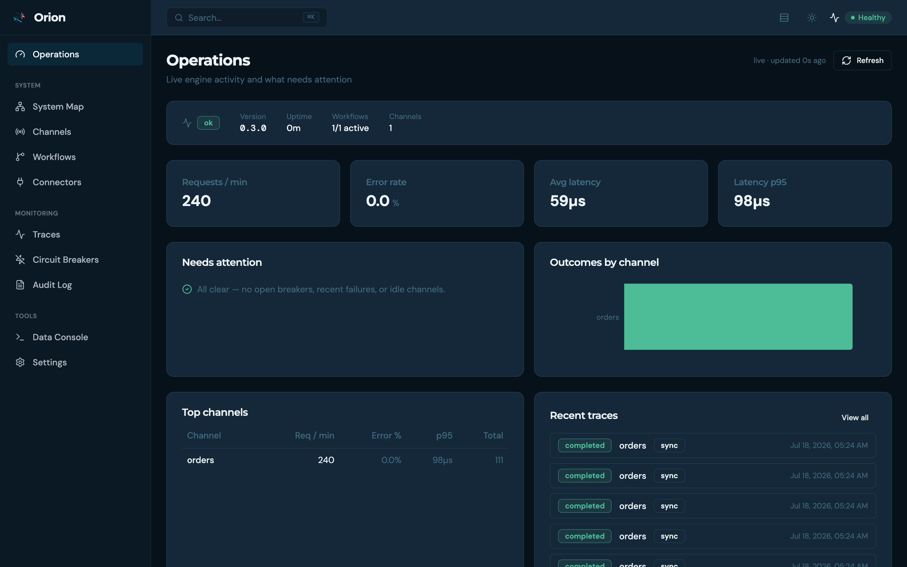
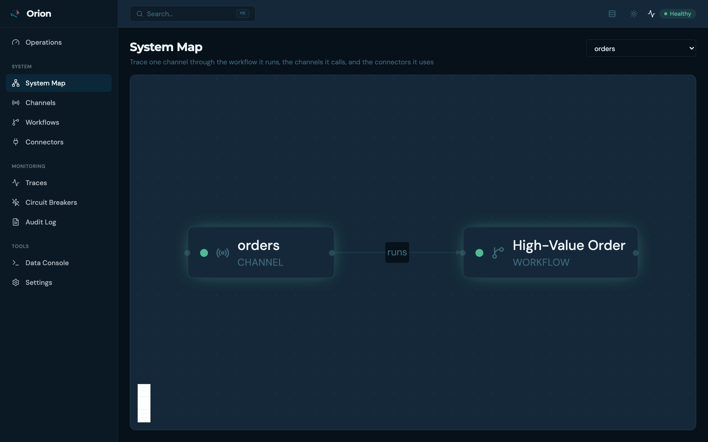
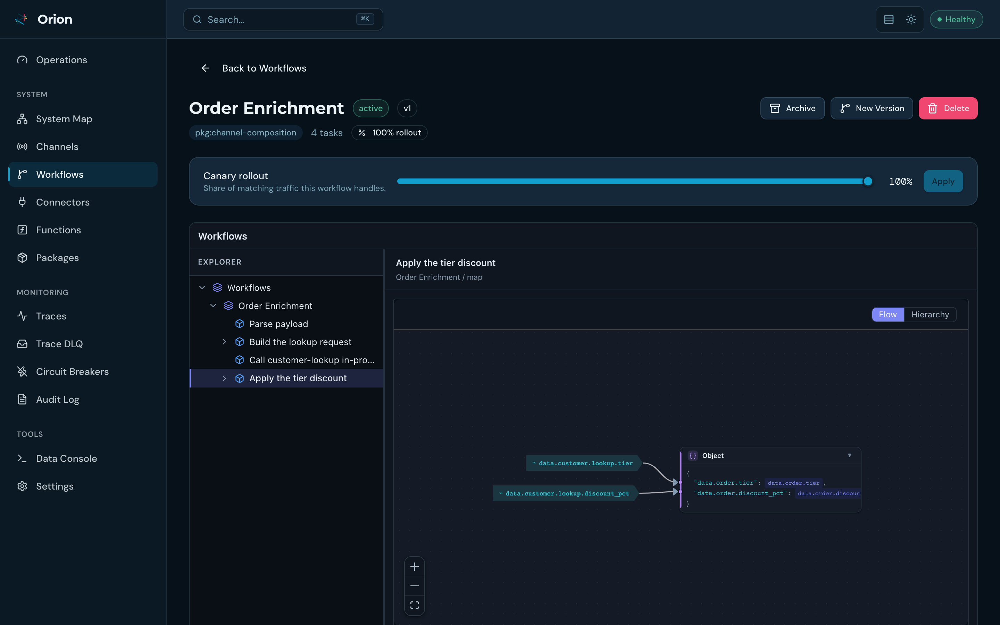
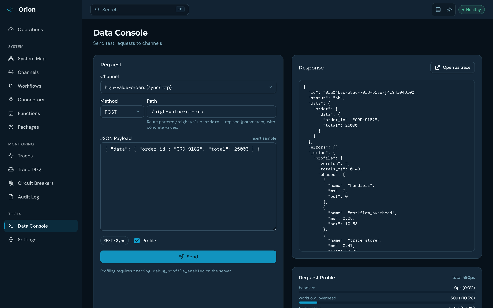

<!-- description: Orion UI is the operations console over the admin API: live dashboards, a channel to workflow to connector system map, trace drill-downs and a data console. -->
# Orion Console

**Tested with:** Orion 1.5.1 · **Last reviewed:** 2026-09-04

Orion itself is API-first — everything in these docs is plain HTTP. [**Orion UI**](https://github.com/GoPlasmatic/Orion-ui)
is the operations console on top of that API: live dashboards, a system map of every
channel → workflow → connector, workflow logic visualization, trace drill-downs, and a
data console for firing test requests. Everything the admin API can do, point-and-click.

## Before you start

You need Docker and a running Orion server. The command below assumes the server
is available on port 8080 and starts the console on port 8081. On Linux,
`host.docker.internal` may require Docker's `host-gateway` mapping; the Orion UI
repository documents deployment-specific alternatives.

## Zero to a live service — no code

The video below demonstrates the full creation loop: import a workflow (paste →
validate → **dry-run** → activate), watch its logic render as a graph, give it
an endpoint with the channel form, send a request from the Data Console, and
see the service on the System Map. Actual time depends on the environment and
the service definition.

<div class="themed-media">
  <video class="media-dark" controls muted playsinline preload="metadata" src="../videos/ui-quickstart-dark.webm"></video>
  <video class="media-light" controls muted playsinline preload="metadata" src="../videos/ui-quickstart-light.webm"></video>
</div>
<span class="asciinema-caption">▶ Click to play. The same flow as <a href="first-service.html">Understand the HTTP Flow</a> — as clicks instead of curl.</span>

## Run it

The UI ships as a production-ready container image (nginx, multi-arch):

```bash
docker run --name orion-console -p 8081:8080 \
  -e ORION_URL=http://host.docker.internal:8080 \
  ghcr.io/goplasmatic/orion-ui:latest
```

> [!IMPORTANT]
> **Keep the console and the server in step.** The console talks to the admin
> API, and 1.0 moved ten of its endpoints under a `{"data": …}` envelope
> ([details](../operate/upgrading-to-1.0.md#every-admin-response-is-now-wrapped-in-data)). A
> console image built before 1.0 will render empty values against a 1.0 server
> rather than erroring. `:latest` is fine for a first look; for anything you
> depend on, pin the tag and move both together.

Open `http://localhost:8081` — `ORION_URL` points at your Orion server and the bundled
nginx reverse-proxies all `/api/` requests to it. Developing against a local checkout?
`npm install && npm run dev` in the [Orion-ui repo](https://github.com/GoPlasmatic/Orion-ui)
does the same via the Vite dev server. A `docker-compose.yml` that brings up server + UI
together is in that repo as well.

## What you get

### Operations dashboard

Live request rate, error rate, latency percentiles, outcomes by channel, top channels,
recent traces, and anything that needs attention (open circuit breakers, idle channels,
recent failures) — for the whole instance, at a glance.

<div class="themed-media">
  
  
</div>

### System Map

Pick any channel and trace it through the workflow it runs, the channels it calls
in-process, and the connectors it touches — as a live topology graph. Every node links to
its detail page.

<div class="themed-media">
  
  
</div>

### Workflow logic, visualized

Workflows are managed through a guided import wizard — paste JSON (often AI-generated),
validate it, import as a draft, **dry-run it against a sample payload**, then activate.
On the detail page, each task's JSONLogic renders as a flow graph, with tabs for
relationships, dry-run testing, version history, and the raw JSON.

<div class="themed-media">
  
  
</div>

### Data Console

Send test requests to any channel — sync or async, with optional per-task profiling —
and inspect the response, the request profile (per-function and per-connector timings),
and the resulting trace, one click away.

<div class="themed-media">
  
  
</div>

Also in the console: channel and connector management with lifecycle actions
(draft → active → archived), circuit-breaker monitoring and reset, the audit log, trace
search and drill-down, and a command palette (<kbd>⌘K</kbd>) for jumping anywhere.

> All visuals on this page are generated from a live instance by the
> [recording pipeline](https://github.com/GoPlasmatic/Orion/tree/main/docs/recordings)
> — re-run `record-ui.sh` and they regenerate.

## Clean up

Stop the foreground container with `Ctrl-C`, then remove it:

```bash
docker rm orion-console
```

The Console stores Orion definitions through the server, so removing the UI
container does not delete workflows, channels, connectors, or traces.

## Next steps

- [Understand the HTTP Flow](./first-service.md) — the same flow as four
  administration calls followed by one endpoint request, if you would rather
  see the wire format.
- [Run the Examples](./examples.md) — services to import and click through.
- [Monitoring & Alerts](../operate/monitoring.md) — the metrics behind the
  dashboard, and what to alert on.
